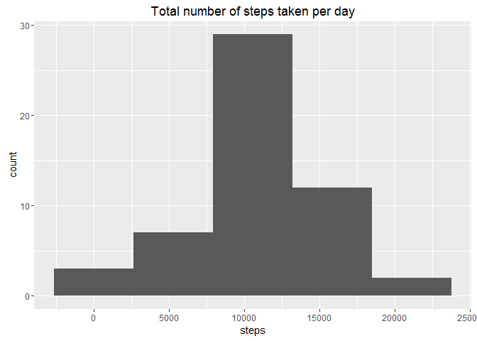

# Reproducible Research: Peer Assessment 1


## Loading and preprocessing the data

```r
activity = read.csv("activity.csv", header = TRUE, as.is = TRUE)
activity$date = as.Date(activity$date)
```


## What is mean total number of steps taken per day?
1. Make a histogram of the total number of steps taken each day

```r
totalStep = aggregate(steps ~ date, activity, sum)
meanStep = mean(totalStep$steps)
medianStep = median(totalStep$steps)

library(ggplot2)
ggplot(totalStep, aes(date,steps))+
  labs(title = "Total number of steps taken per day") +
  geom_bar(stat = "identity")
```

<!-- -->

2. Calculate and report the mean and median total number of steps taken per day  

> **mean**   total number of steps taken per day: **10766.1886792453**  
> **median** total number of steps taken per day: **10765**  


## What is the average daily activity pattern?
1. Make a time series plot (i.e. type = "l") of the 5-minute interval (x-axis)
and the average number of steps taken, averaged across all days (y-axis)

```r
avgStep = aggregate(steps ~ interval, activity, mean)

library(ggplot2)
ggplot(avgStep, aes(interval,steps))+
  labs(title = "Number of steps in 5-minute interval averaged across all days") +
  geom_line(stat = "identity")
```

<!-- -->

2. Which 5-minute interval, on average across all the days in the dataset,
contains the maximum number of steps?  

> On average across all the days in the dataset, 5-minute interval **835** contains the maximum number of steps.  

## Imputing missing values
Note that there are a number of days/intervals where there are missing values
(coded as NA). The presence of missing days may introduce bias into some
calculations or summaries of the data.
1. Calculate and report the total number of missing values in the dataset
(i.e. the total number of rows with NAs)

```r
paste("Total number of rows with NAs:", sum(is.na(activity$steps)))
```

```
## [1] "Total number of rows with NAs: 2304"
```

2. Devise a strategy for filling in all of the missing values in the dataset. The
strategy does not need to be sophisticated. For example, you could use
the mean/median for that day, or the mean for that 5-minute interval, etc.  

> Filling strategy: mean for that 5-minute interval  
  
3. Create a new dataset that is equal to the original dataset but with the
missing data filled in.  

```r
fillActivity = activity
fill_naIdx = is.na(fillActivity$steps)

for( loopDate in as.list(unique(fillActivity$date)) )
{
  fill_dateIdx = fillActivity$date == loopDate
  replaceIdx = fill_dateIdx & fill_naIdx;
  
  insertIdx = is.na(fillActivity[fill_dateIdx,"steps"])
    
  fillActivity[replaceIdx,"steps"] = avgStep[insertIdx,"steps"]
}
print( paste("is.na checking: ", sum(is.na(fillActivity$steps))) )
```

```
## [1] "is.na checking:  0"
```

4. Make a histogram of the total number of steps taken each day and Calculate
and report the mean and median total number of steps taken per day. Do
these values differ from the estimates from the first part of the assignment?
What is the impact of imputing missing data on the estimates of the total
daily number of steps?  

```r
totalStep = aggregate(steps ~ date, fillActivity, sum)
meanStep = mean(totalStep$steps)
medianStep = median(totalStep$steps)

library(ggplot2)
ggplot(totalStep, aes(date,steps))+
  labs(title = "Total number of steps taken per day") +
  geom_bar(stat = "identity")
```

<!-- -->
  
> Imputing missing data causing more data fall on the mean value.     
  
  
## Are there differences in activity patterns between weekdays and weekends?
1. Create a new factor variable in the dataset with two levels - "weekday"
and "weekend" indicating whether a given date is a weekday or weekend
day.

```r
fillActivity$weekdays = weekdays(fillActivity$date)

weekend_weekday = fillActivity$weekdays %in% c("Saturday","Sunday")

fillActivity[weekend_weekday, "weekdays"] = "weekend"
fillActivity[!weekend_weekday, "weekdays"] = "weekday"

fillActivity$weekdays = factor(fillActivity$weekdays)
```

2. Make a panel plot containing a time series plot (i.e. type = "l") of the
5-minute interval (x-axis) and the average number of steps taken, averaged
across all weekday days or weekend days (y-axis).

```r
avgWeekday = aggregate(steps ~ interval+weekdays, fillActivity, mean)

library(ggplot2)
ggplot(avgWeekday, aes(interval,steps))+
  facet_wrap( ~ weekdays, nrow = 2, ncol = 1) + 
  labs(title = "Number of steps in 5-minute interval averaged across all days") +
  geom_line(stat = "identity")
```

<!-- -->

> It's observed that weekend steps are scattered around the day, while weekday are gathered at morning.
